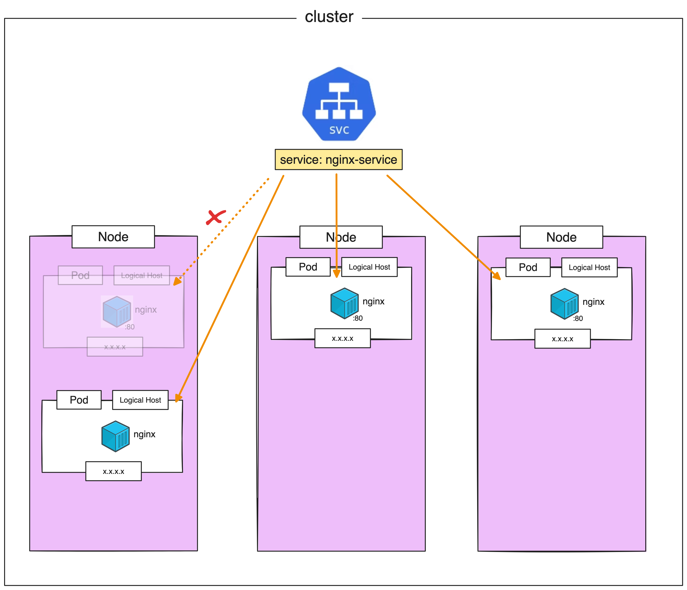

# ClusterIP

> [!IMPORTANT]  
> **Goal:** Create service with **ClusterIP** type and proving Stable IP concept


---
### Stable IP

Create `service.yml`
```
apiVersion: apps/v1
kind: Deployment
metadata:
  name: nginx-deployment
  labels:
    app: nginx-deployment
spec:
  replicas: 3
  selector:
    matchLabels:
      app: my-nginx  # has to match .spec.template.metadata.labels.app
  template:
    metadata:
      labels:
        app: my-nginx
    spec:
      containers:
      - name: nginx
        image: nginx:1.24.0
        ports:
        - containerPort: 80
---
apiVersion: v1
kind: Service
metadata:
  name: nginx-service
spec:
  selector:
    app: my-nginx # has to match .spec.template.metadata.labels.app on kind: Deployment
  ports:
    - protocol: TCP
      port: 80
      targetPort: 80
```

Apply
```
kubectl apply -f service.yml 
```

Get all
```
kubectl get all
```

Describe service
```
kubectl describe service nginx-service
```

:computer: output:
```
Name:              nginx-service
Namespace:         default
Labels:            <none>
Annotations:       <none>
Selector:          app=my-nginx
Type:              ClusterIP
IP Family Policy:  SingleStack
IP Families:       IPv4
IP:                10.43.127.173
IPs:               10.43.127.173
Port:              <unset>  80/TCP
TargetPort:        80/TCP
Endpoints:         10.42.0.24:80,10.42.1.20:80,10.42.2.23:80
Session Affinity:  None
Events:            <none>
```
Endpoints have match with pod's ips

Get pod for view IPs
```
kubectl get pod -o wide
```

Delete 1 pod
```
kubectl delete pod nginx-deployment-799d5dcc86-k9tzl
```

Get pod for view IPs again
```
kubectl get pod -o wide
```

Describe service
```
kubectl describe service nginx-service
```

:computer: output:
```
Name:              nginx-service
Namespace:         default
Labels:            <none>
Annotations:       <none>
Selector:          app=my-nginx
Type:              ClusterIP
IP Family Policy:  SingleStack
IP Families:       IPv4
IP:                10.43.127.173
IPs:               10.43.127.173
Port:              <unset>  80/TCP
TargetPort:        80/TCP
Endpoints:         10.42.0.24:80,10.42.1.20:80,10.42.2.24:80
Session Affinity:  None
Events:            <none>
```

Endpoints are revised and match with pod's IPs