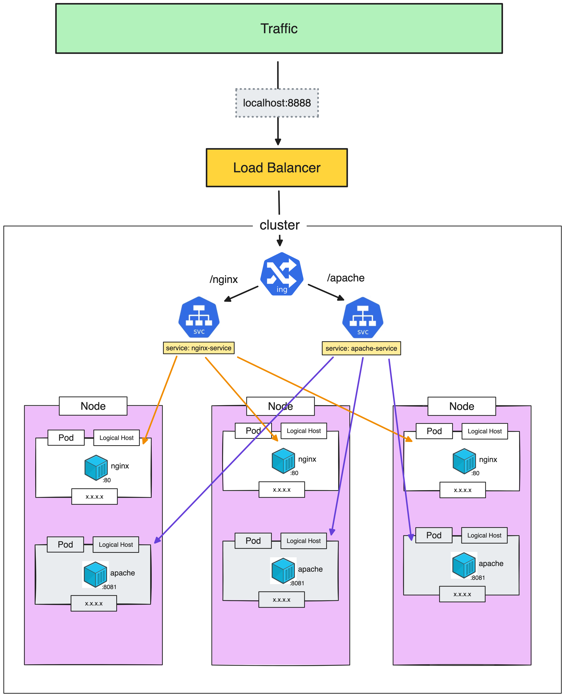

# Ingress

> [!IMPORTANT]  
> **Goal:** Create **Ingress** for connecting from external and custom path to redirect to service


---

### Setup Cluster

Delete existing cluster
> $ k3d cluster delete <CLUSTER_NAME>
```
k3d cluster delete my-cluster
```

Create new cluster with expose loadbalancer port
```
k3d cluster create my-cluster --servers 1 --agents 3 --port "8888:80@loadbalancer" --port "8889:443@loadbalancer"
```
---

### Create Pod, Deployment and Service for nginx

Create `service_nginx.yml`
```
apiVersion: apps/v1
kind: Deployment
metadata:
  name: nginx-deployment
  labels:
    app: nginx-deployment
spec:
  replicas: 3
  selector:
    matchLabels:
      app: my-nginx # has to match .spec.template.metadata.labels.app
  template:
    metadata:
      labels:
        app: my-nginx
    spec:
      containers:
      - name: nginx
        image: nginx:1.24.0
        ports:
        - containerPort: 80
---
apiVersion: v1
kind: Service
metadata:
  name: nginx-service
spec:
  type: ClusterIP
  selector:
    app: my-nginx # has to match .spec.template.metadata.labels.app on kind: Deployment
  ports:
    - protocol: TCP
      port: 80
      targetPort: 80
```

Apply service
```
kubectl apply -f service_nginx.yml 
```

Get all
```
kubectl get all
```
or
```
kubectl get service
```

:computer: output:
```
NAME            TYPE        CLUSTER-IP    EXTERNAL-IP   PORT(S)   AGE
kubernetes      ClusterIP   10.43.0.1     <none>        443/TCP   90s
nginx-service   ClusterIP   10.43.17.13   <none>        80/TCP    24s
```
---
### Create ingress

Create `ingress.yml`
```
apiVersion: networking.k8s.io/v1
kind: Ingress
metadata:
  name: my-ingress
spec:
  rules:
  - http:
      paths:
      - path: /
        pathType: Prefix
        backend:
          service:
            name: nginx-service
            port:
              number: 80
```

Apply ingress
```
kubectl apply -f ingress.yml 
```

Get & describe ingress
```
kubectl get ingress
```
```
kubectl describe ingress my-ingress
```

Go to: http://localhost:8888

Should see nginx page

---
### Custom path name for redirect to nginx service

Replace `ingress.yml`
```
apiVersion: traefik.containo.us/v1alpha1
kind: Middleware
metadata:
  name: my-ingress-middleware
spec:
  stripPrefix:
    forceSlash: false
    prefixes:
      - /nginx
---
apiVersion: networking.k8s.io/v1
kind: Ingress
metadata:
  name: my-ingress
  annotations:
    traefik.ingress.kubernetes.io/router.middlewares: default-my-ingress-middleware@kubernetescrd
spec:
  rules:
  - http:
      paths:
      - path: /nginx
        pathType: Prefix
        backend:
          service:
            name: nginx-service
            port:
              number: 80
```
Go to: http://localhost:8888/nginx

Should see nginx page

---

### Create Pod, Deployment and Service for apache

Create `service_apache.yml`
```
apiVersion: apps/v1
kind: Deployment
metadata:
  name: apache-deployment
  labels:
    app: apache-deployment
spec:
  replicas: 3
  selector:
    matchLabels:
      app: my-apache # has to match .spec.template.metadata.labels.app
  template:
    metadata:
      labels:
        app: my-apache
    spec:
      containers:
      - name: apache
        image: httpd:2.4.59
        ports:
        - containerPort: 80
---
apiVersion: v1
kind: Service
metadata:
  name: apache-service
spec:
  type: ClusterIP
  selector:
    app: my-apache # has to match .spec.template.metadata.labels.app on kind: Deployment
  ports:
    - protocol: TCP
      port: 8081
      targetPort: 80
```

Apply service
```
kubectl apply -f service_apache.yml 
```

```
kubectl get service
```

:computer: output:
```
kubernetes       ClusterIP   10.43.0.1      <none>        443/TCP    10m
nginx-service    ClusterIP   10.43.6.84     <none>        80/TCP     9m42s
apache-service   ClusterIP   10.43.34.240   <none>        8081/TCP   15s
```

---

### Custom path name for redirect to apache service
Updated `ingress.yml`
```
apiVersion: traefik.containo.us/v1alpha1
kind: Middleware
metadata:
  name: my-ingress-middleware
spec:
  stripPrefix:
    forceSlash: false
    prefixes:
      - /nginx
      - /apache   <===================== add here
---
apiVersion: networking.k8s.io/v1
kind: Ingress
metadata:
  name: my-ingress
  annotations:
    traefik.ingress.kubernetes.io/router.middlewares: default-my-ingress-middleware@kubernetescrd
spec:
  rules:
  - http:
      paths:
      - path: /nginx
        pathType: Prefix
        backend:
          service:
            name: nginx-service
            port:
              number: 80
      - path: /apache     <===================== add here
        pathType: Prefix
        backend:
          service:
            name: apache-service
            port:
              number: 8081
```

Describe ingress
```
kubectl describe ingress my-ingress
```

Go to: http://localhost:8888/apache

Should see apache page

---

### Clean cluster

Delete cluster
```
k3d cluster delete my-cluster
```
