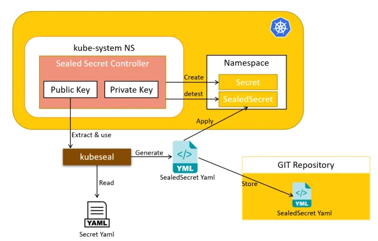

# Sealed Secrets

- https://github.com/bitnami-labs/sealed-secrets
- https://foxutech.medium.com/bitnami-sealed-secrets-kubernetes-secret-management-86c746ef0a79



---

### Setup

Client
```
brew install kubeseal
```

Install on Controller
```
kubectl apply -f https://github.com/bitnami-labs/sealed-secrets/releases/download/v0.20.5/controller.yaml
```

Ensure that the relevant Pod is running
```
kubectl get pods -n kube-system | grep sealed-secrets-controller
```

---

### Implementation
Cretae `secret.yml`
```
apiVersion: v1
kind: Secret
metadata:
  name: my-database-secret
type: Opaque
data:
  DB_USER: ZXhhbXBsZXVzZXI=
  DB_PASSWORD: ZXhhbXBsZXBhc3M=
```

Generate public key
```
kubeseal --fetch-cert > public-key-cert.pem
```

Create `sealed-secret.yml`
```
kubeseal --format=yaml --cert=public-key-cert.pem < secret.yml > sealed-secret.yml
```

:computer: output:
```
---
apiVersion: bitnami.com/v1alpha1
kind: SealedSecret
metadata:
  creationTimestamp: null
  name: my-database-secret
  namespace: default
spec:
  encryptedData:
    DB_PASSWORD: AgBkBPYqx+jCq3MtYAsD2idMCyBDEx4ib5ndRhF1/ipWwBk1w58VTWcmfiKhdcWX4BTfU0q3/agj7cq+tDykVlwoKg/608Bb/NS+B6T85hcrvVufuubbBw2I7X6nZkuDruOSFvLPWV+XaXUJPjEhRrHwIcKrgq7DjPmbleycq5oZkdHMu44XMMwAhG1F8Yqtp38DuVmke17NduvrT4y7Awnr0Oz/DODqeyTP2V8Y3EOmV3Pvblmvq1omPjrB4m+f8HN+0Ba+GaO/KMtLnj0KD5xkEhk4Yh90lMLVjdK5VtISv8HEbq9QKlHcnuAxaSkZFxzqehC8SS7lB7kwnKHIWyN5FCIlOWG6QqiOokKy8QlCsMBu7XPezFWM/RJ7jJauJh/V1i2EK9+Vh94ELZYqWcY6rCyTtqyNthMzF4sFXdUjDvDC0GhwEH85e/v3OcOmkRavRqU3Vk5GBVl6LbPmGUsRvcHB7Nq2VVlL1UgKtc+6TmlCZ32aDojOPpS4e9rNL0dCqNauJzvLJXgoOSkRruHOInjzqGK4yjbKRnhXT23k9k/3R9S6euiWw8iSX5eEHbJrRliPICKlT2XqJoVr9Aibt5wh1NcU2LxysRGIYazT6dFNj8vf7+gWC0/tlOSJAyfIZ65TCpjf0lkGqQAGtze55EfuE/pP1fmNCBLtrRSo006rqIHtf60oRrt7CFBUlq41201/uKsx/NWIzg==
    DB_USER: AgA49Wfzh2jdo33EZ+/nWi9OhIhw1dw8beVAyEiDW9+wO0SkXS9f0wiE5SZhgUeC8FIWEXrHQv2krEBD6mYAcCYyh5JQKSRw+ViZ9q8f6Y3FxDPg9m5TRP+LdZDVKPAK1BrDzIwg25Hu8wdPztJpMgCRT3Ab6+1P4vgYFel8OGz6bZg5TujhvekH8jPV1L7t+r227VEI0tlN7FMdBSh7kgvPqRQ1242CCQHRO8Wm0N3FP1cQ/IxYgdok8T9JeBE2kc7uY5yw4mOqtmOX8k7YUyqdx5OU971WAtWWNhEPfWVHJGjw9cu+XRRO9kSYa9vo4kf9P/mTl06zP2vD5Q9a9w+f1FTvpopCpoQnHpdwLcCNsCFRggiOgvdF7v5Zp5EwJzFXhT4Kauan9ON5jeiGwnF3knCOEBapQ5wFW6vfT8sGUnNivWPj7sljYGXKPDXznEpcCXbsno9RvnwRz7sfdhlfnfc9SiDKc64hNI7l464Z5U+6e9rODmHfhJKcT317yaVi3CRr9wBMqjVP7vlxzRJDiJ3obzD2Jt2ejT1qsq1zcWPOu7Z7BQxFDDNUENn1+C7+JGwKPlH+lxz+qgxgIv9kQyHpReImvp63T+VJHPRAggrnEe2Po/4hjzS3qjSA4Ge9w3BOq2gv4gACBlWtL20A9dGSlV1l37lAdWSJwc8C98ALLa4f1rGZ4ahTpTawQTWGqgz0qBqmBKotiA==
  template:
    metadata:
      creationTimestamp: null
      name: my-database-secret
      namespace: default
    type: Opaque
```

Apply `sealed-secret.yml`
```
kubectl apply -f sealed-secret.yml
```

View original Secret
```
kubectl get secret my-database-secret -o yaml
```