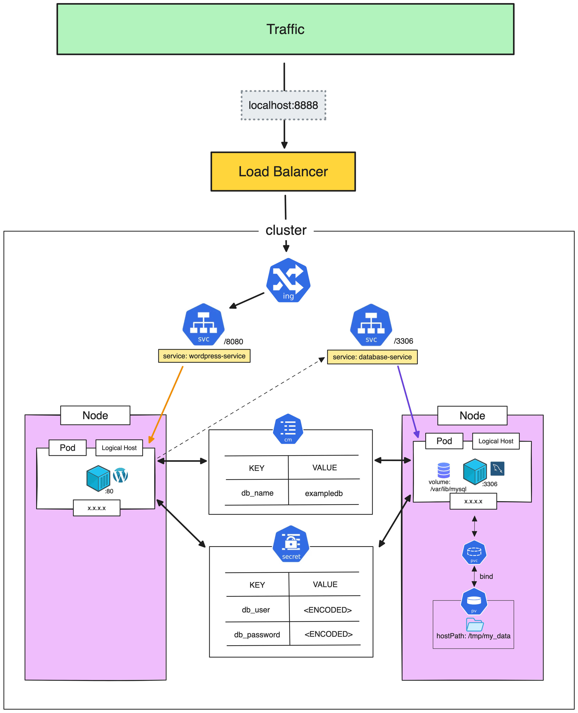

# Persistent Volume

> [!IMPORTANT]  
> **Goal:** Create PV & PVC and apply in cluster



---

### Setup Cluster

Use result cluster from `05_configmap_secret` workshop

---

### Create PV

Create `pv.yml`
```
apiVersion: v1
kind: PersistentVolume
metadata:
  name: my-pv
spec:
  storageClassName: demo
  persistentVolumeReclaimPolicy: Retain
  capacity:
    storage: 5Gi
  accessModes:
    - ReadWriteOnce
  hostPath:
    path: "/tmp/my_data"
  nodeAffinity:
    required:
      nodeSelectorTerms:
      - matchExpressions:
        - key: kubernetes.io/hostname
          operator: In
          values:
          - k3d-my-cluster-agent-0
```

Apply PV
```
kubectl apply -f pv.yml
```

Get PV
```
kubectl get pv
```

:computer: output:
```
NAME    CAPACITY   ACCESS MODES   RECLAIM POLICY   STATUS      CLAIM   STORAGECLASS   REASON   AGE
my-pv   5Gi        RWO            Retain           Available           demo                    7s
```
STATUS is Available and CLAIM is blank

---

### Create PVC

Create `pvc.yml`
```
apiVersion: v1
kind: PersistentVolumeClaim
metadata:
  name: my-pvc
spec:
  storageClassName: demo
  accessModes:
    - ReadWriteOnce
  resources:
    requests:
      storage: 5Gi
```

Apply PVC
```
kubectl apply -f pvc.yml
```

Get PVC
```
kubectl get pvc
```

:computer: output:
```
NAME     STATUS   VOLUME   CAPACITY   ACCESS MODES   STORAGECLASS   AGE
my-pvc   Bound    my-pv    5Gi        RWO            demo           4s
```

Get PV
```
kubectl get pv
```

:computer: output:
```
NAME    CAPACITY   ACCESS MODES   RECLAIM POLICY   STATUS   CLAIM            STORAGECLASS   REASON   AGE
my-pv   5Gi        RWO            Retain           Bound    default/my-pvc   demo                    3m10s
```

STATUS is Bound and CLAIM is my-pvc

---

### Update mysql to use PV
Update `mysql.yml`
```
apiVersion: apps/v1
kind: Deployment
metadata:
  name: mysql-deployment
spec:
  selector:
    matchLabels:
      app: my-mysql
  template:
    metadata:
      labels:
        app: my-mysql
    spec:
      containers:
      - name: mysql
        image: mysql:8.0
        env:
        - name: MYSQL_DATABASE
          valueFrom:
            configMapKeyRef:
              name: database-config
              key: db_name
        - name: MYSQL_USER
          valueFrom:
            secretKeyRef:
              name: my-database-secret
              key: DB_USER
        - name: MYSQL_PASSWORD
          valueFrom:
            secretKeyRef:
              name: my-database-secret
              key: DB_PASSWORD
        - name: MYSQL_RANDOM_ROOT_PASSWORD
          value: '1'
        ports:
        - containerPort: 3306
        volumeMounts:     <========================= Add here
        - name: my-mysql-volume
          mountPath: /var/lib/mysql
      volumes:            <========================= Add here
      - name: my-mysql-volume
        persistentVolumeClaim:
          claimName: my-pvc
```

Apply mysql
```
kubectl apply -f mysql.yml
```

Waiting for mysql pod recreated
```
kubectl get pod -w -o wide
```
Notice: mysql pod running on `k3d-my-cluster-agent-0` node

Go to http://localhost:8888/ and setup wordpress

Delete pod
```
kubectl delete pod mysql-deployment-5f455f795c-m9tzc
```

Waiting for mysql pod recreated
```
kubectl get pod -w -o wide
```

Go to http://localhost:8888/ again, should be not setup again

---

### Clean cluster

Delete cluster
```
k3d cluster delete my-cluster
```
