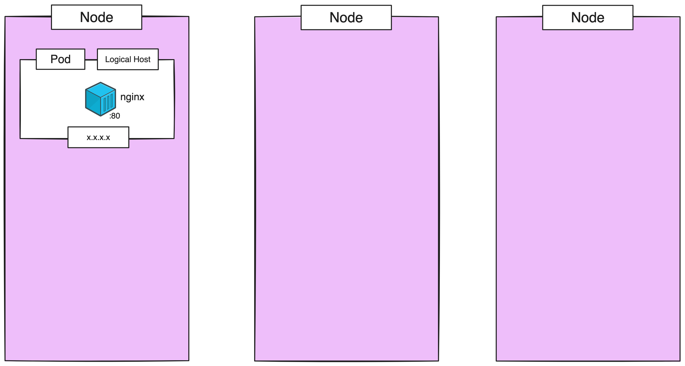

# Pod

### Kubectl basic command

View command:
```
kubectl --help
```

Get node:
```
kubectl get node
```

Get node more information:
```
kubectl get node -o wide
```

View all resources:
```
kubectl api-resources
```

---

> [!IMPORTANT]  
> **Goal:** Create nginx pod in cluster



---

### Setup Cluster

Create new cluster
```
k3d cluster create my-cluster --servers 1 --agents 3 --port "8888:80@loadbalancer" --port "8889:443@loadbalancer"
```

Setting taint for prevent pod deploy master node (k3d not set by default)
```
kubectl taint node k3d-my-cluster-server-0 node-role.kubernetes.io/master:NoSchedule
```
---

### Run Pod

Run pod with nginx image

> $ kubectl run <POD_NAME> --image <IMAGES_NAME>:<IMAGES_TAG>
```
kubectl run my-nginx --image nginx:1.25.4
```

Check pod
```
kubectl get pod
```

Check pod more information
```
kubectl get pod -o wide
```

Describe pod
> $ kubectl describe pod <POD_NAME>
```
kubectl describe pod my-nginx
```

:computer: output:
```
Events:
  Type    Reason     Age   From               Message
  ----    ------     ----  ----               -------
  Normal  Scheduled  12m   default-scheduler  Successfully assigned default/my-nginx to k3d-my-cluster-agent-0
  Normal  Pulling    12m   kubelet            Pulling image "nginx:1.25.4"
  Normal  Pulled     12m   kubelet            Successfully pulled image "nginx:1.25.4" in 10.126673794s (10.126688933s including waiting)
  Normal  Created    12m   kubelet            Created container my-nginx
  Normal  Started    12m   kubelet            Started container my-nginx
```

View pod logs
> $ kubectl logs <POD_NAME>
```
kubectl logs my-nginx
```

Edit pod
> $ kubectl edit pod <POD_NAME>
```
kubectl edit pod my-nginx
```
change image to `nginx:1.24.0` and save

then run
```
kubectl get pod 
```

:computer: output:
```
NAME       READY   STATUS    RESTARTS       AGE
my-nginx   1/1     Running   1 (111s ago)   28m
```

Notice **RESTARTS TIME**, will be just moment seconds


Describe pod again
```
kubectl describe pod my-nginx
```

:computer: output:
```
Events:
  Type    Reason     Age               From               Message
  ----    ------     ----              ----               -------
  Normal  Scheduled  32m               default-scheduler  Successfully assigned default/my-nginx to k3d-my-cluster-agent-0
  Normal  Pulling    32m               kubelet            Pulling image "nginx:1.25.4"
  Normal  Pulled     32m               kubelet            Successfully pulled image "nginx:1.25.4" in 10.126673794s (10.126688933s including waiting)
  Normal  Killing    6m13s             kubelet            Container my-nginx definition changed, will be restarted
  Normal  Pulling    6m12s             kubelet            Pulling image "nginx:1.24.0"
  Normal  Pulled     6m                kubelet            Successfully pulled image "nginx:1.24.0" in 12.304054934s (12.304091644s including waiting)
  Normal  Created    6m (x2 over 32m)  kubelet            Created container my-nginx
  Normal  Started    6m (x2 over 32m)  kubelet            Started container my-nginx
```
---

### Run Pod with yml 

Delete Pod

> $ kubectl delete pod <POD_NAME>
```
kubectl delete pod my-nginx
```

Create yml file name: `nginx.yml`
```
apiVersion: v1
kind: Pod
metadata:
  name: my-nginx
spec:
  containers:
  - name: nginx
    image: nginx:1.24.0
    ports:
    - containerPort: 80
```

Apply with yml file
> $ kubectl apply -f <FILE>
```
kubectl apply -f nginx.yml
```

Edit file change image to `nginx:1.25.4` and save and `kubectl apply -f nginx.yml` again

Describe pod again
```
kubectl describe pod my-nginx
```
Image tag will be change to `nginx:1.25.4`

---
### Delete

Delete
```
kubectl delete -f nginx.yml
```
