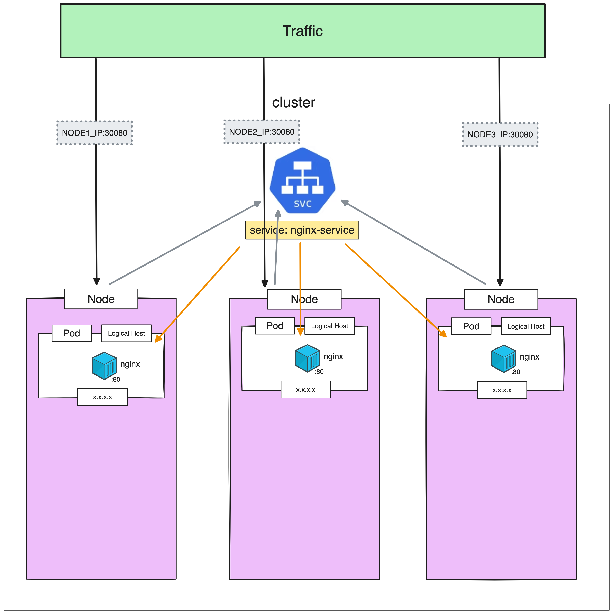

# NodePort

> [!IMPORTANT]  
> **Goal:** Create service with **NodePort** type and connecting from external


---

### Setup Cluster

Delete existing cluster
> $ k3d cluster delete <CLUSTER_NAME>
```
k3d cluster delete my-cluster
```

Create new cluster with expose port
```
k3d cluster create my-cluster --servers 1 --agents 3 -p "30080:30080@agent:0" -p "30081:30080@agent:1" -p "30082:30080@agent:2"
```
---

### Create NodePort service type

Create `service.yml`
```
apiVersion: apps/v1
kind: Deployment
metadata:
  name: nginx-deployment
  labels:
    app: nginx-deployment
spec:
  replicas: 3
  selector:
    matchLabels:
      app: my-nginx # has to match .spec.template.metadata.labels.app
  template:
    metadata:
      labels:
        app: my-nginx
    spec:
      containers:
      - name: nginx
        image: nginx:1.24.0
        ports:
        - containerPort: 80
---
apiVersion: v1
kind: Service
metadata:
  name: nginx-service
spec:
  type: NodePort
  selector:
    app: my-nginx # has to match .spec.template.metadata.labels.app on kind: Deployment
  ports:
    - protocol: TCP
      port: 80
      targetPort: 80
      nodePort: 30080 # range (30000-32767)
```

Apply
```
kubectl apply -f service.yml 
```

Get all
```
kubectl get all
```
or
```
kubectl get service
```

Go to: http://localhost:30080

Should see nginx page

---

### Clean cluster

Delete cluster
```
k3d cluster delete my-cluster
```
