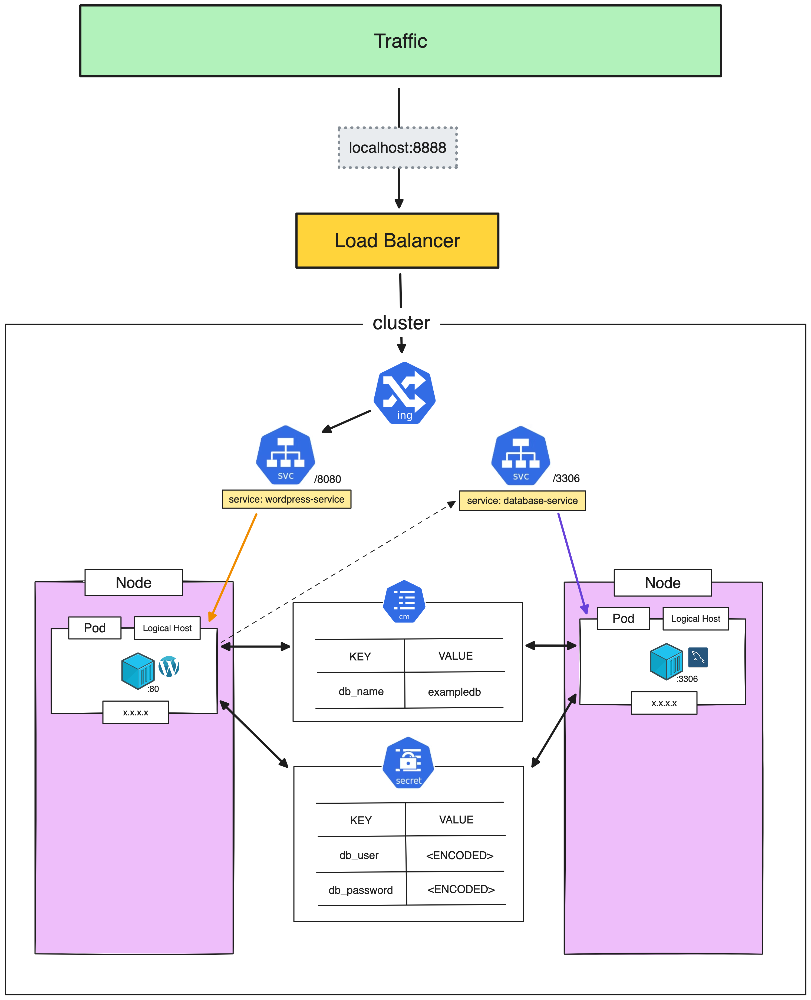

# ConfigMap & Secret

> [!IMPORTANT]  
> **Goal:** Create Wordpress and apply with **ConfigMap** and **Secret**



---

### Setup Cluster

Delete existing cluster
> $ k3d cluster delete <CLUSTER_NAME>
```
k3d cluster delete my-cluster
```

Create new cluster with expose loadbalancer port
```
k3d cluster create my-cluster --servers 1 --agents 3 --port "8888:80@loadbalancer" --port "8889:443@loadbalancer"
```

### Create Pod, Deployment and Service for mysql

Create `mysql.yml`
```
apiVersion: apps/v1
kind: Deployment
metadata:
  name: mysql-deployment
spec:
  selector:
    matchLabels:
      app: my-mysql
  template:
    metadata:
      labels:
        app: my-mysql
    spec:
      containers:
      - name: mysql
        image: mysql:8.0
        env:
        - name: MYSQL_DATABASE
          valueFrom:
            configMapKeyRef:
              name: database-config
              key: db_name
        - name: MYSQL_USER
          valueFrom:
            configMapKeyRef:
              name: database-config
              key: db_user
        - name: MYSQL_PASSWORD
          valueFrom:
            configMapKeyRef:
              name: database-config
              key: db_password
        - name: MYSQL_RANDOM_ROOT_PASSWORD
          value: '1'
        ports:
        - containerPort: 3306
---
apiVersion: v1
kind: Service
metadata:
  name: database-service
spec:
  selector:
    app: my-mysql
  ports:
    - protocol: TCP
      port: 3306
      targetPort: 3306
```

Apply `mysql.yml`
```
kubectl apply -f mysql.yml
```

Get pod
```
kubectl get pod
```

Describe pod
```
kubectl describe pod mysql-deployment-776f897b97-s6gt7
```

:computer: output:
```
Events:
  Type     Reason     Age               From               Message
  ----     ------     ----              ----               -------
  Normal   Scheduled  49s               default-scheduler  Successfully assigned default/mysql-deployment-776f897b97-s6gt7 to k3d-my-cluster-agent-0
  Normal   Pulling    50s               kubelet            Pulling image "mysql:8.0"
  Normal   Pulled     31s               kubelet            Successfully pulled image "mysql:8.0" in 19.244909294s (19.244934254s including waiting)
  Normal   Pulled     8s (x3 over 30s)  kubelet            Container image "mysql:8.0" already present on machine
  Warning  Failed     8s (x4 over 30s)  kubelet            Error: configmap "database-config" not found
```

---

### Create ConfigMap

Create `configmap.yml`

```
apiVersion: v1
kind: ConfigMap
metadata:
  name: database-config
data:
  db_name: exampledb
  db_user: exampleuser
  db_password: examplepass
```

Apply `configmap.yml`
```
kubectl apply -f configmap.yml
```

Get configmap
```
kubectl get configmap 
```

Get pod
```
kubectl get pod 
```

Pods will be running

---

### Create Pod, Deployment and Service for Wordpress

Create `wordpress.yml`
```
apiVersion: apps/v1
kind: Deployment
metadata:
  name: wordpress-deployment
spec:
  selector:
    matchLabels:
      app: my-wordpress
  template:
    metadata:
      labels:
        app: my-wordpress
    spec:
      containers:
      - name: wordpress
        image: wordpress:6.5.0-php8.1-fpm-alpine
        env:
        - name: WORDPRESS_DB_HOST
          value: database-service
        - name: WORDPRESS_DB_NAME
          valueFrom:
            configMapKeyRef:
              name: database-config
              key: db_name
        - name: WORDPRESS_DB_USER
          valueFrom:
            configMapKeyRef:
              name: database-config
              key: db_user
        - name: WORDPRESS_DB_PASSWORD
          valueFrom:
            configMapKeyRef:
              name: database-config
              key: db_password
        ports:
        - containerPort: 80
---
apiVersion: v1
kind: Service
metadata:
  name: wordpress-service
spec:
  selector:
    app: my-wordpress
  ports:
    - protocol: TCP
      port: 8080
      targetPort: 80
```

Apply `wordpress.yml`
```
kubectl apply -f wordpress.yml
```

Get all
```
kubectl get all
```

Checking all will be ready/running

---

### Create Ingress

Create `ingress.yml`
```
apiVersion: networking.k8s.io/v1
kind: Ingress
metadata:
  name: my-ingress
spec:
  rules:
  - http:
      paths:
      - path: /
        pathType: Prefix
        backend:
          service:
            name: wordpress-service
            port:
              number: 8080
```

Apply ingress
```
kubectl apply -f ingress.yml
```

Go to http://localhost:8888, should see Wordpress page

---

### Diagram with ConfigMap


---

### Apply secret

Create `secret.yml`
```
apiVersion: v1
kind: Secret
metadata:
  name: my-database-secret
type: Opaque
data:
  DB_USER: ZXhhbXBsZXVzZXI=
  DB_PASSWORD: ZXhhbXBsZXBhc3M=
```
> command encode to base64: `$ echo -n <TEXT> | base64 `
> command decode to base64: `$ echo <TEXT> | base64 -d`

Apply Secret
```
kubectl apply -f secret.yml
```

Update `configmap.yml`, remove `db_user` and `db_password`
```
apiVersion: v1
kind: ConfigMap
metadata:
  name: database-config
data:
  db_name: exampledb
  # db_user: exampleuser       <============ Remove
  # db_password: examplepass   <============ Remove
```

Apply ConfigMap
```
kubectl apply -f configmap.yml
```

Update `wordpress.yml`
```
        ...

        - name: WORDPRESS_DB_USER
          valueFrom:
            secretKeyRef:     <============= change to use secretKeyRef
              name: my-database-secret
              key: DB_USER
        - name: WORDPRESS_DB_PASSWORD
          valueFrom:
            secretKeyRef:     <============= change to use secretKeyRef
              name: my-database-secret
              key: DB_PASSWORD

        ...              
```

Update `mysql.yml`
```
        ...

        - name: MYSQL_USER
          valueFrom:
            secretKeyRef:     <============= change to use secretKeyRef
              name: my-database-secret
              key: DB_USER
        - name: MYSQL_PASSWORD
          valueFrom:
            secretKeyRef:     <============= change to use secretKeyRef
              name: my-database-secret
              key: DB_PASSWORD

        ...              
```

Apply `wordpress.yml`
```
kubectl apply -f wordpress.yml
```

Apply `mysql.yml`
```
kubectl apply -f mysql.yml
```

Get pod
```
kubectl get pod
```

It will be recreate pods

Go to http://localhost:8888, should see Wordpress page

---

### Clean cluster

> [!WARNING]  
> **Not Clean yet, will be use in next workshop**
