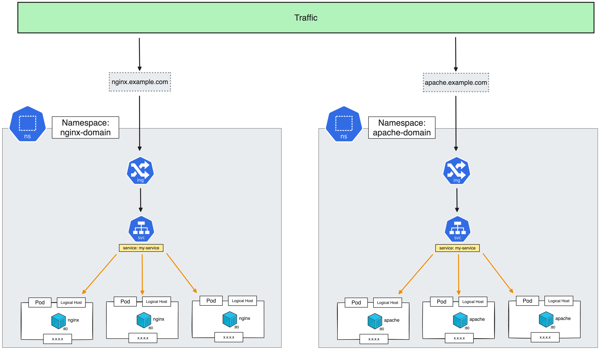

# Namespace

> [!IMPORTANT]  
> **Goal:** Create application on 2 namespaces separate by domain name



---

### Setup Cluster

Delete existing cluster
> $ k3d cluster delete <CLUSTER_NAME>
```
k3d cluster delete my-cluster
```

Create new cluster with expose loadbalancer port
```
k3d cluster create my-cluster --servers 1 --agents 3 --port "8888:80@loadbalancer" --port "8889:443@loadbalancer"
```
---

### Create namespaces

List
```
kubectl get namespace
```
or
```
kubectl get ns
```

:computer: output:
```
NAME              STATUS   AGE
default           Active   3h57m
kube-system       Active   3h57m
kube-public       Active   3h57m
kube-node-lease   Active   3h57m
```

Create `namespace.yml`
```
apiVersion: v1
kind: Namespace
metadata:
  name: nginx-domain
  labels:
    name: nginx-domain
---
apiVersion: v1
kind: Namespace
metadata:
  name: apache-domain
  labels:
    name: apache-domain
```

Apply namespace
```
kubectl apply -f namespace.yml
```
---

### Create nginx on namespace nginx-domain

Create `service_nginx.yml`
```
apiVersion: apps/v1
kind: Deployment
metadata:
  name: my-deployment
  labels:
    app: my-deployment
spec:
  replicas: 1
  selector:
    matchLabels:
      app: my-web # has to match .spec.template.metadata.labels.app
  template:
    metadata:
      labels:
        app: my-web
    spec:
      containers:
      - name: web
        image: nginx:1.24.0
        ports:
        - containerPort: 80
---
apiVersion: v1
kind: Service
metadata:
  name: my-service
spec:
  type: ClusterIP
  selector:
    app: my-web # has to match .spec.template.metadata.labels.app on kind: Deployment
  ports:
    - protocol: TCP
      port: 80
      targetPort: 80
```

Apply nginx with nginx-domain namespace 
```
kubectl apply -f service_nginx.yml --namespace nginx-domain
```

Get all with nginx-domain namespace
```
kubectl get all --namespace nginx-domain
```

Check resource in apache-domain
```
kubectl get all --namespace apache-domain
```
Should be have not any resources

---

### Create nginx on namespace apache-domain
Apply nginx with apache-domain namespace 
```
kubectl apply -f service_nginx.yml --namespace apache-domain
```

Check resource on apache-domain
```
kubectl get all --namespace apache-domain
```

---

### Create ingress on both namespace

Create `ingress.yml`
```
apiVersion: networking.k8s.io/v1
kind: Ingress
metadata:
  name: my-ingress
  namespace: nginx-domain
spec:
  rules:
  - host: nginx.example.com
    http:
      paths:
      - path: /
        pathType: Prefix
        backend:
          service:
            name: my-service
            port:
              number: 80
---
apiVersion: networking.k8s.io/v1
kind: Ingress
metadata:
  name: my-ingress
  namespace: apache-domain
spec:
  rules:
  - host: apache.example.com
    http:
      paths:
      - path: /
        pathType: Prefix
        backend:
          service:
            name: my-service
            port:
              number: 80
```

Apply ingress with both namespaces
```
kubectl apply -f ingress.yml
```

Check ingress
```
kubectl get ingress -n nginx-domain
```
```
kubectl get ingress -n apache-domain
```

---

### Config host file for each domain

#### macos
```
sudo nano /etc/hosts
```

```
### add here
127.0.0.1    nginx.example.com
127.0.0.1    apache.example.com
```

#### windows
locate to: `C:\Windows\System32\drivers\etc`

```
### add here
127.0.0.1    nginx.example.com
127.0.0.1    apache.example.com
```

Try to open browser

http://nginx.example.com:8888 and http://apache.example.com:8888

---

### Change my-web pod nginx to apache on namespace apache-domain
Create `service_apache.yml`
```
apiVersion: apps/v1
kind: Deployment
metadata:
  name: my-deployment
  labels:
    app: my-deployment
spec:
  replicas: 1
  selector:
    matchLabels:
      app: my-web # has to match .spec.template.metadata.labels.app
  template:
    metadata:
      labels:
        app: my-web
    spec:
      containers:
      - name: web
        image: httpd:2.4.59      <============= change nginx to httpd
        ports:
        - containerPort: 80
---
apiVersion: v1
kind: Service
metadata:
  name: my-service
spec:
  type: ClusterIP
  selector:
    app: my-web # has to match .spec.template.metadata.labels.app on kind: Deployment
  ports:
    - protocol: TCP
      port: 80
      targetPort: 80
```

Apply apache on apache-domain namespace 
```
kubectl apply -f service_apache.yml --namespace apache-domain
```

Try to open browser

- http://nginx.example.com:8888 open nginx
- http://apache.example.com:8888 open apache

---

### Helping command

View resources all namespace
```
kubectl get pod --all-namespaces
```
or
```
kubectl get pod -A
```

Setting default namespace
```
kubectl config set-context --current --namespace=nginx-domain
```

View current namespace
```
kubectl config get-contexts
```

---

### Clean cluster

> [!WARNING]  
> **Not Clean yet, will be use in next workshop**
