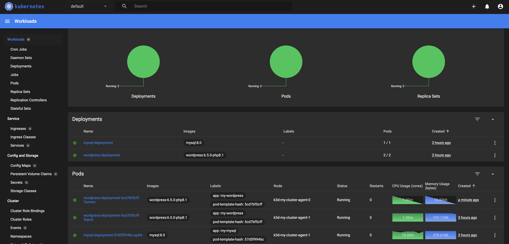

# Kubernetes Dashboard

> [!IMPORTANT]  
> **Goal:** Create Kubernetes Dashboard



---

### Setup Cluster

Delete existing cluster
> $ k3d cluster delete <CLUSTER_NAME>
```
k3d cluster delete my-cluster
```

Create new cluster with expose loadbalancer port
```
k3d cluster create my-cluster --servers 1 --agents 3 --port "8888:80@loadbalancer" --port "8889:443@loadbalancer"
```
---

### Deploying Kubernetes Dashboard

Apply
```
kubectl apply -f https://raw.githubusercontent.com/kubernetes/dashboard/v2.7.0/aio/deploy/recommended.yaml
```

Create `admin_user.yml`
```
apiVersion: v1
kind: ServiceAccount
metadata:
  name: admin-user
  namespace: kubernetes-dashboard
---
apiVersion: rbac.authorization.k8s.io/v1
kind: ClusterRoleBinding
metadata:
  name: admin-user
roleRef:
  apiGroup: rbac.authorization.k8s.io
  kind: ClusterRole
  name: cluster-admin
subjects:
  - kind: ServiceAccount
    name: admin-user
    namespace: kubernetes-dashboard
```

Apply
```
kubectl apply -f admin_user.yml
```

Proxy
```
kubectl proxy 
```

Go to browser:
```
http://localhost:8001/api/v1/namespaces/kubernetes-dashboard/services/https:kubernetes-dashboard:/proxy/
```

Get token
```
kubectl create token admin-user  --namespace kubernetes-dashboard
```

---

### Clean cluster

Delete cluster
```
k3d cluster delete my-cluster
```
