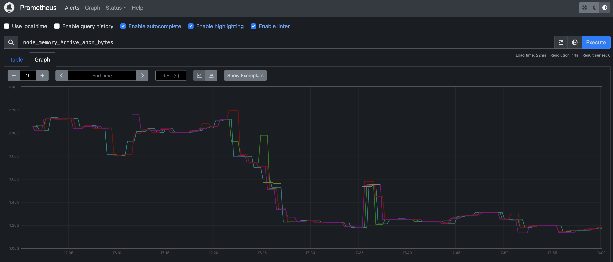
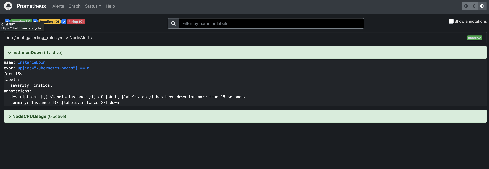

# Prometheus

> [!IMPORTANT]  
> **Goal:** Running Prometheus and setting alert rules

Ref: https://artifacthub.io/packages/helm/prometheus-community/prometheus


---

### Setup Cluster

Use result cluster from `10_monitoring/01_kubernetes_dashboard` workshop

---

### Deploying Prometheus

Add repository
```
helm repo add prometheus-community https://prometheus-community.github.io/helm-charts
```

Create `Chart.yaml`
```
apiVersion: v2
name: my-prometheus-helm
description: A Helm chart for Prometheus Demo
type: application
version: 1.0.0

dependencies:
  - name: "prometheus"
    alias: prometheus
    condition: prometheus.enabled
    repository: "https://prometheus-community.github.io/helm-charts"
    version: "25.19.1"
```

Update dependencies
```
helm dependency update
```

View file before run (optional)
```
helm template .
```

Running prometheus
```
helm upgrade -i prometheus . -n monitoring --create-namespace
```

---

### Enable ingress
Create `values.yaml`
```
prometheus:
  server:
    ingress:
      enabled: true
      hosts:
        - prometheus.example.com
```
> Configurations: https://github.com/helm/charts/blob/master/stable/prometheus/README.md#configuration

Helm upgrade
```
helm upgrade -i prometheus . -n monitoring --create-namespace
```

Config host file for domain
```
sudo nano /etc/hosts
```

```
### add here
127.0.0.1    prometheus.example.com
127.0.0.1    grafana.example.com
```

Go to http://prometheus.example.com:8888/

Should be prometheus page

---

### Setting Alert rules
Updating `values.yaml`
```
prometheus:
  server:
    ingress:
      enabled: true
      hosts:
        - prometheus.example.com
  serverFiles:         <============================== Add here
    alerting_rules.yml:
      groups:
      - name: NodeAlerts
        rules:
        - alert: InstanceDown
          expr: up{job="kubernetes-nodes"} == 0
          for: 15s
          labels:
            severity: critical
          annotations:
            summary: "Instance [{{ $labels.instance }}] down"
            description: "[{{ $labels.instance }}] of job {{ $labels.job }} has been down for more than 15 seconds."

        - alert: NodeCpuUsage
          expr: (100 - (avg(irate(node_cpu_seconds_total{mode="idle"}[2m])) BY (instance) * 100)) > 80
          for: 2m
          labels:
            severity: warning
          annotations:
            summary: '{{$labels.instance}}: High CPU usage detect'
            description: '{{$labels.instance}}: CPU usage is above 80% (current value is: {{ $value }})'
```

Helm upgrade
```
helm upgrade -i prometheus . -n monitoring --create-namespace
```

Go to http://prometheus.example.com:8888/alerts for check alert rules



Try to add new node
```
k3d node create new-agent  --cluster my-cluster 
```

Try to delete new node
```
k3d node delete k3d-new-agent-0
```

Get node for check node status
```
kubectl get node
```

Go to http://prometheus.example.com:8888/alerts and check again

---

### Clean cluster

> [!WARNING]  
> **Not Clean yet, will be use in next workshop**
