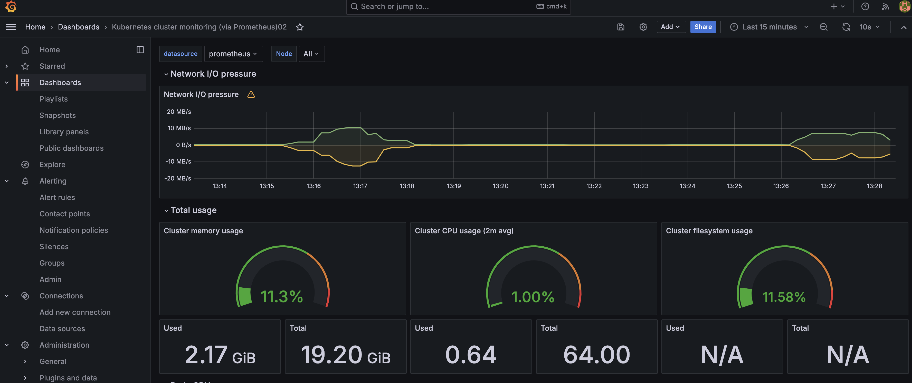
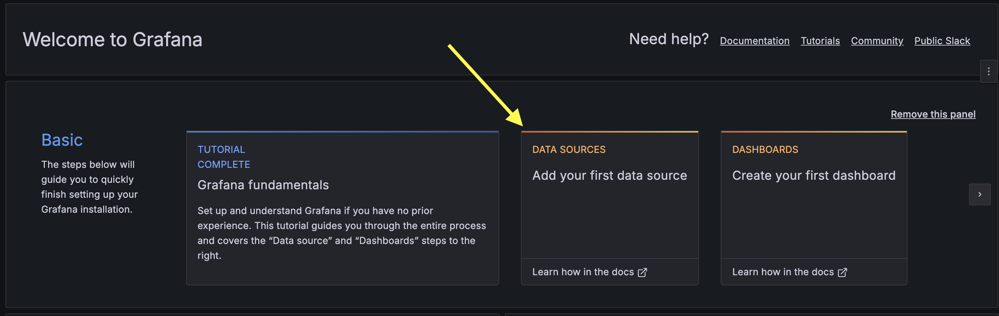
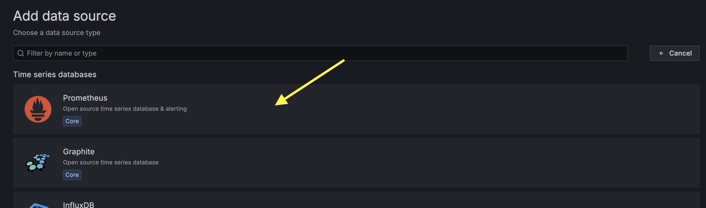
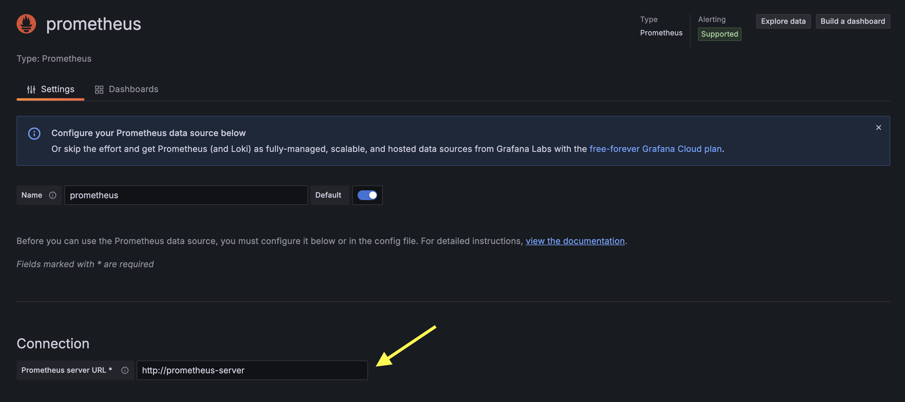
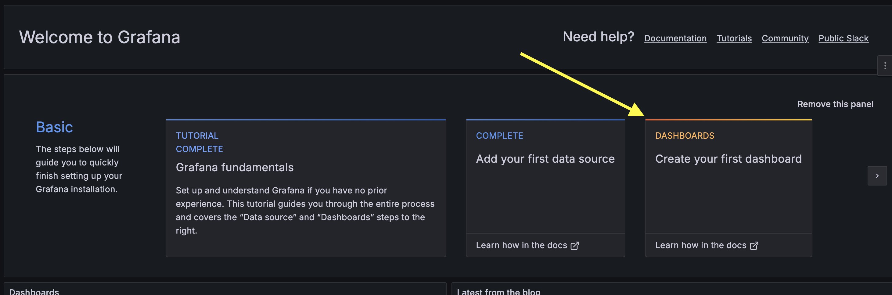
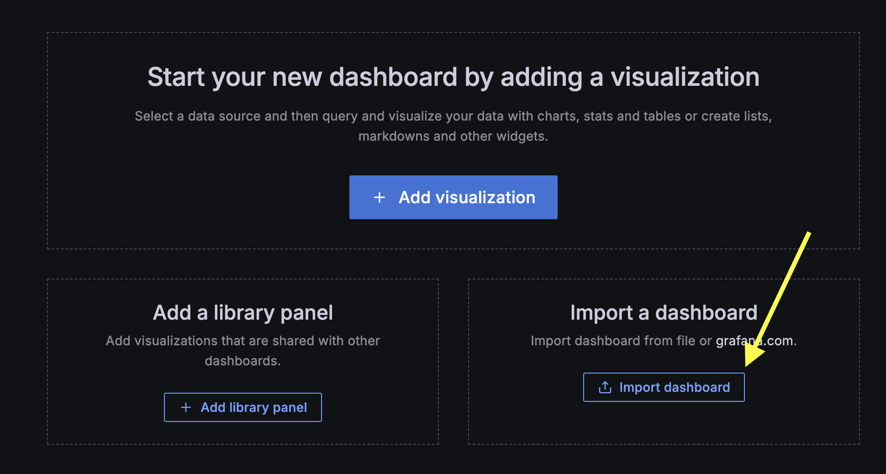
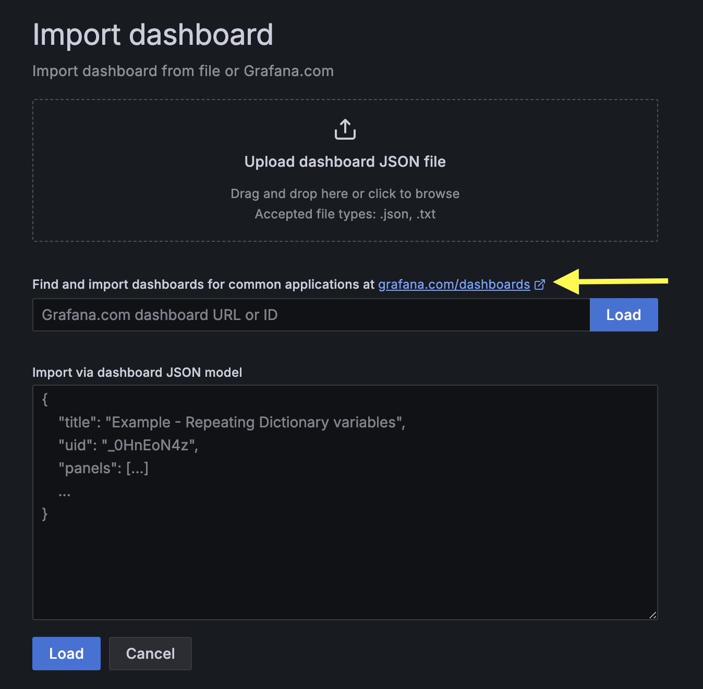
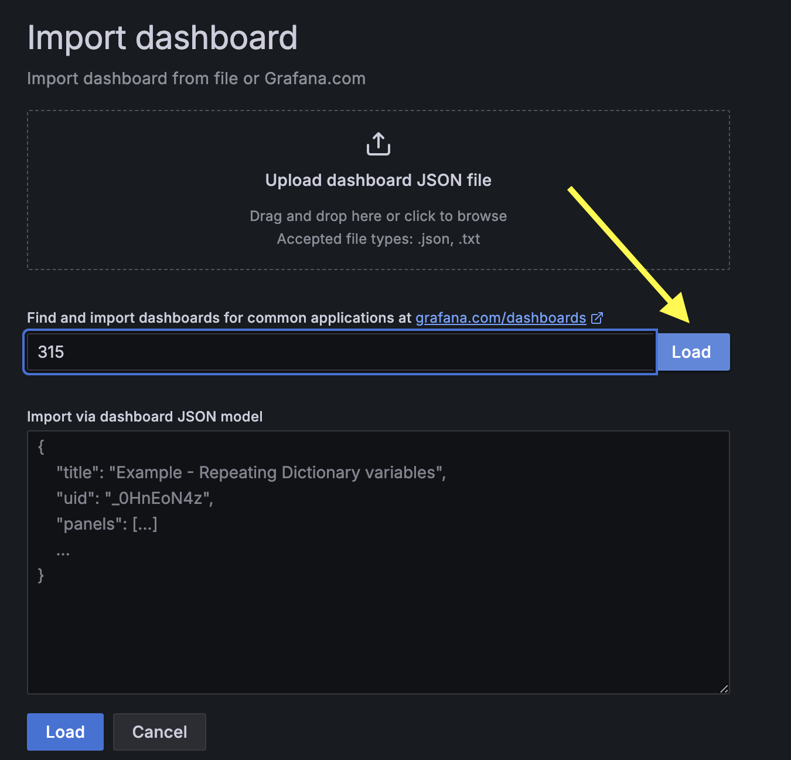
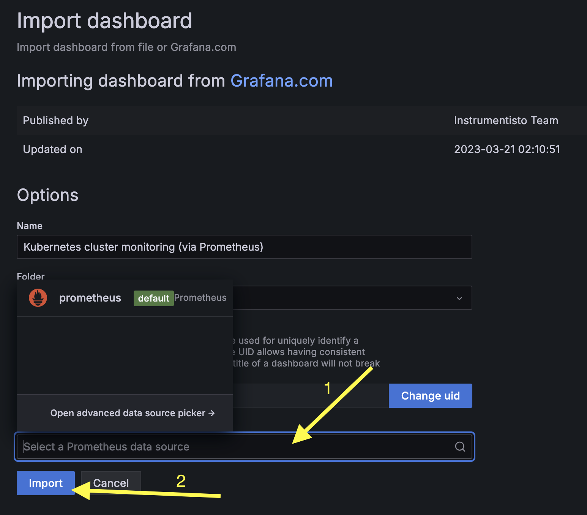
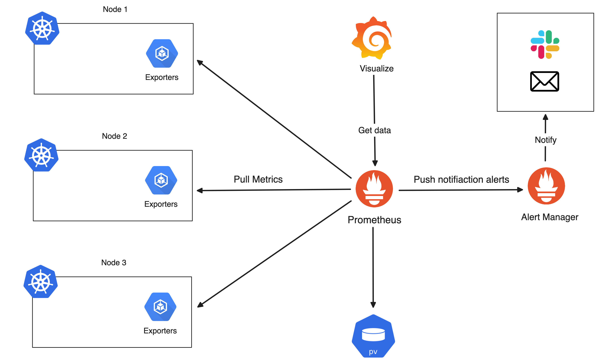

# Grafana

> [!IMPORTANT]  
> **Goal:** Running Grafana with prometheus metric

Ref: https://artifacthub.io/packages/helm/grafana/grafana


---

### Setup Cluster

Use result cluster from `10_monitoring/02_prometheus` workshop

---

### Deploying Grafana

Add repository
```
helm repo add grafana https://grafana.github.io/helm-charts
```

Create `Chart.yaml`
```
apiVersion: v2
name: my-grafana-helm
description: A Helm chart for Grafana Demo
type: application
version: 1.0.0

dependencies:
  - name: "grafana"
    alias: grafana
    condition: grafana.enabled
    repository: "https://grafana.github.io/helm-charts"
    version: "7.3.8"
```

Update dependencies
```
helm dependency update
```

View file before run (optional)
```
helm template .
```

Running Grafana
```
helm upgrade -i grafana . -n monitoring --create-namespace
```

---

### Enable ingress
Create `values.yaml`
```
grafana:
  ingress:
    enabled: true
    hosts:
      - grafana.example.com
```

Helm upgrade
```
helm upgrade -i grafana . -n monitoring --create-namespace
```

Go to http://grafana.example.com:8888/

Should be grafana page

---

### Login

Username: **admin**

Password:
```
kubectl get secret grafana -n monitoring -o jsonpath="{.data.admin-password}" | base64 -d ; echo
```

---

### Setup Grafana

#### Add datasources


Choose Prometheus


Input prometheus server url as prometheus service's name
```
kubectl get service -n monitoring
```

So input `http://prometheus-server`



#### Add Dashboard 



import dashboard


Choose template


Input dashboard id for examples: `315`, `6417`, then click load button


Select prometheus data source and click import button


Should see the dashboard

Now diagram is like this:



---

### Clean cluster

> [!WARNING]  
> **Not Clean yet, will be use in next workshop**
