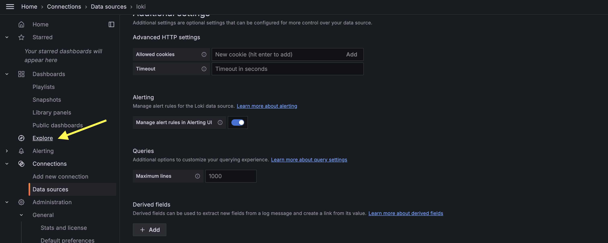

# Logs with Loki

> [!IMPORTANT]  
> **Goal:** Running Grafana with Loki logs

Ref: https://artifacthub.io/packages/helm/grafana/loki-stack


---

### Setup Cluster

Use result cluster from `10_monitoring/03_grafana` workshop

---

### Deploying Loki

Add repository
```
helm repo add grafana https://grafana.github.io/helm-charts
```

Create `Chart.yaml`
```
apiVersion: v2
name: my-loki-helm
description: A Helm chart for Loki Demo
type: application
version: 1.0.0

dependencies:
  - name: "loki-stack"
    alias: loki
    condition: loki-stack.enabled
    repository: "https://grafana.github.io/helm-charts"
    version: "2.10.2"
```

Create `values.yaml`
```
loki:
  loki:
    image:
      repository: grafana/loki
      tag: 2.9.3
```

> [!NOTE]  
> If not specific image version it will use version `2.6.1` that cannot sync datasouces with Grafana so must define version

Update dependencies
```
helm dependency update
```

View file before run (optional)
```
helm template .
```

Running Loki
```
helm upgrade -i loki . -n monitoring --create-namespace
```

Checking Loki resoures
```
kubectl get all -n monitoring
```

---

### Setup data sources on Grafana

Open Grafana then add datasources


choose Loki


Input loki server url as loki service's name
```
kubectl get service -n monitoring
```
So input `http://loki:3100`, Click save&test button


If all work, will be like this


Go to sidebar > Explore


Choose Loki


Choose label filter and run query


> [!NOTE]  
> Loki has not display defaut namespace

---

### Clean cluster

> [!WARNING]  
> **Not Clean yet, will be use in next workshop**
