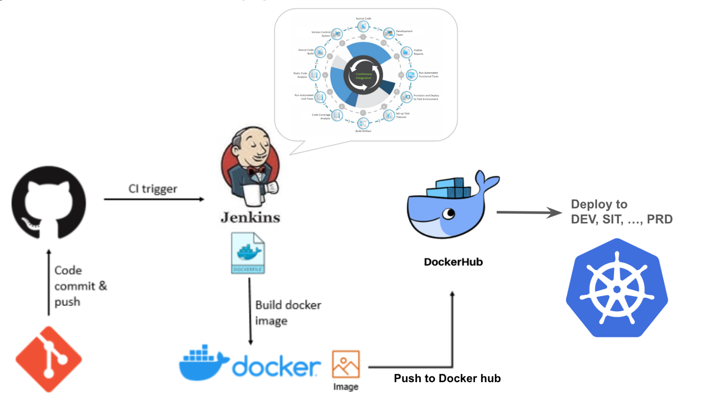

# Pipeline

> [!IMPORTANT]  
> **Goal:** Create CI/CD pipeline with Jenkins

Steps
1. Running Jenkins
2. Add credential & install jenkins plugins
3. Setup pipeline & create ci
4. Create cd (Add deployment to pipeline)
5. Checking results



---

### Setup Cluster

Delete existing cluster
> $ k3d cluster delete <CLUSTER_NAME>
```
k3d cluster delete my-cluster
```

Create new cluster with expose loadbalancer port
```
k3d cluster create my-cluster --servers 1 --agents 3 --port "8888:80@loadbalancer" --port "8889:443@loadbalancer"
```

---

### 1. Running Jenkins in machine

Start Jenkins
```
docker compose up
```

Go to http://localhost:5555

Copy your container id by `docker ps | grep jenkins`

Get your password by replace `<CONTAINER_ID>` with output form `docker ps | grep jenkins`

```
docker exec <CONTAINER_ID> cat /var/jenkins_home/secrets/initialAdminPassword
```

Choosing install suggested plugin and waiting a moment

Filling username, password, full name and email 

Setting Jenkins URL: `http://localhost:5555/` (by default)

---

### 2.1 Add docker hub credential

Go to http://localhost:5555/manage/credentials/store/system/domain/_/

Click `Add credential` button

- Kind: Username with password
- Scope: Global
- Username: `YOUR_DOCKER_HUB_USER`
- Password: `YOUR_DOCKER_HUB_PASSWORD`
- ID: docker_hub
- Description: docker hub

---

### 2.2 Add kube_config credential

On the cluster run this command for generate `kubeConfig` file
```
kubectl config view --minify --raw > kubeConfig
```

Modify `kubeConfig` file change `0.0.0.0` to `host.docker.internal`
```
apiVersion: v1
clusters:
- cluster:
    certificate-authority-data: LS0tL ...
    server: https://host.docker.internal:55720     <=============== Update here 
  name: k3d-my-cluster
contexts:
- context:
    cluster: k3d-my-cluster
    user: admin@k3d-my-cluster
  name: k3d-my-cluster
current-context: k3d-my-cluster
kind: Config
preferences: {}
users:
- name: admin@k3d-my-cluster
  user:
    client-certificate-data: LS0tL ... 
```

Go to http://localhost:5555/manage/credentials/store/system/domain/_/

Click `Add credential` button

- Kind: Secret file
- Scope: Global
- File: \<browse your `kubeConfig` file \>
- ID: kube_config
- Description: \<blank\>

---

### 2.3 Add jenkins plugins for kubernetes 

Manage Jenkins > Plugins > Available plugins > search `kubernetes CLI` > checked and install


---

### 3. Setup pipeline & create ci

On first page click `+ New Item` menu

Enter pipeline name for example `demo_pipeline`

Click Pipeline option and submit 

then input code to pipeline script

```
pipeline {
    agent any

    stages {
        stage('Checkout code') {
            steps {
              git branch: 'main', url: 'https://github.com/srankmeng/my-k8s-traning.git'
            }
        }
        stage('Code analysis') {
            steps {
                echo 'Code analysis'
            }
        }
        stage('Unit test') {
            steps {
                echo 'Unit test'
            }
        }
        stage('Code coverage') {
            steps {
                echo 'Code coverage'
            }
        }
        stage('Build images') {
            steps {
                sh 'docker compose -f ./workshops/12_pipeline/json-server/docker-compose.yml build'
            }
        }
        stage('Setup & Provisioning') {
            steps {
                sh 'docker compose -f ./workshops/12_pipeline/json-server/docker-compose.yml up -d'
            }
        }
        stage('Run api automate test') {
            steps {
                sh 'docker compose -f ./workshops/12_pipeline/newman/docker-compose.yml build'
                sh 'docker compose -f ./workshops/12_pipeline/newman/docker-compose.yml up'
            }
        }
        stage('Push Docker Image to Docker Hub') {
            steps {
                withCredentials([usernamePassword(credentialsId: 'docker_hub', passwordVariable: 'DOCKER_PASS', usernameVariable: 'DOCKER_USER')]) {
                    sh 'docker login -u $DOCKER_USER -p $DOCKER_PASS'
                    sh '''docker image tag my_json_server:1.0 $DOCKER_USER/my_json_server:$BUILD_NUMBER
                            docker image push $DOCKER_USER/my_json_server:$BUILD_NUMBER'''
                }        
            }
        }     
    }
    post {
        always {
            sh 'docker compose -f ./workshops/12_pipeline/json-server/docker-compose.yml down'
        }
    }
}
```

---

### 4.1 Add deployment to pipeline

Add 'Deploy application' stage after `stage('Push Docker Image to Docker Hub')`

```
        stage('Deploy application') {
            steps {
                withKubeConfig([credentialsId: 'kube_config']) {
                    sh 'kubectl apply -f ./workshops/12_pipeline/deploy/service.yml'
                    sh 'kubectl apply -f ./workshops/12_pipeline/deploy/ingress.yml'
                    withCredentials([usernamePassword(credentialsId: 'docker_hub', passwordVariable: 'DOCKER_PASS', usernameVariable: 'DOCKER_USER')]) {
                        sh 'kubectl set image deployment/json-server-deployment json-server=$DOCKER_USER/my_json_server:$BUILD_NUMBER'
                    }
                } 
            }
        }
        stage('Rollout status') {
            steps {
                withKubeConfig([credentialsId: 'kube_config']) {
                    sh 'kubectl rollout status deployment/json-server-deployment --timeout=3m'
                } 
            }
        }
```
Go to `http://localhost:8888`

Check resources
```
kubectl get all
```

---

### 4.2 Polling git for trigger pipelines
Go to the pipeline: Configure > Build Triggers > Poll SCM > input `* * * * *`

---

### Blue Ocean - plugin

Manage Jenkins > Plugins > Available plugins > search `blue ocean` > checked and install

---

### Clean cluster

Delete cluster
```
k3d cluster delete my-cluster
```
